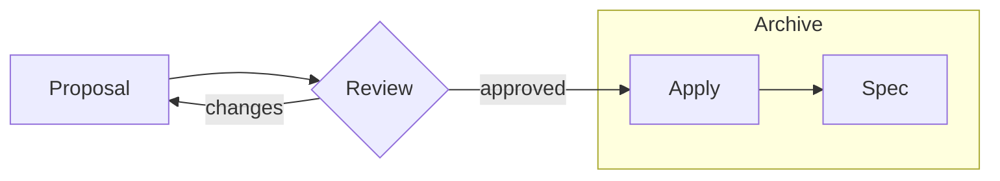
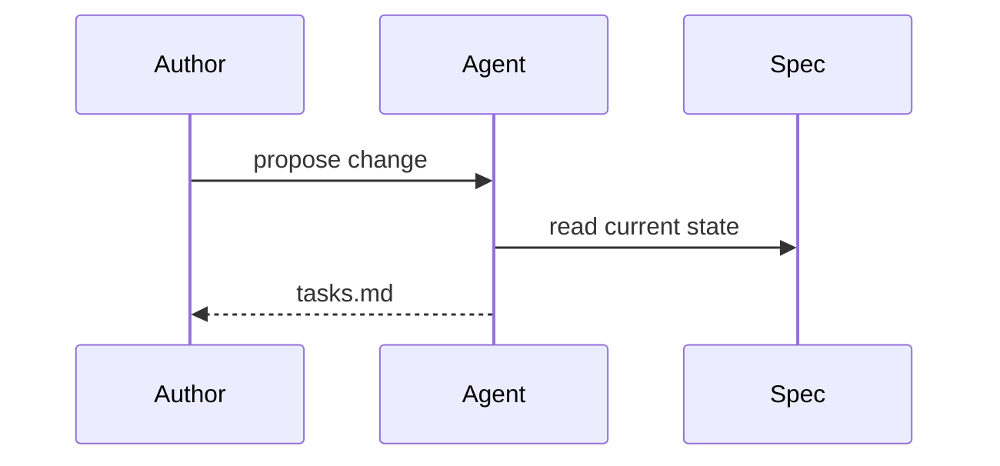
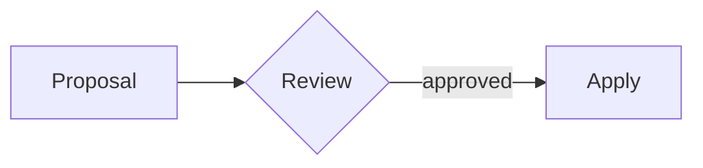

# Layout gallery

## Every layout, every slot

slidev-theme-gepardec

Rendered from the theme source

---
layout: default
class: gepardec-text-sm
---

# Cover

Each layout in this deck renders itself. Where a layout has no room for prose — `cover`, `section`, `contact` — the slide after it carries the source.

```md
---
layout: cover
---

# Layout gallery

## Every layout, every slot
```

- The first heading is the *Titel*, the second the *Untertitel* — both uppercased by the layout
- Every paragraph after them drops to the bottom-left *Name / Datum* block
- The cheetah bleeds off the left edge; the title column starts at ~34%

---
layout: agenda
---

# Agenda

- Cover and section
- Agenda
- Quadrants
- Default content
- Two columns
- Two columns with a headline
- Statement
- Contact
- The rules, on every slide that has room

---
layout: default
class: gepardec-text-sm
---

# Agenda

Nine entries, so the slide before this one already split: `// 1` to `// 6` down the left, the rest down the right.

```md
---
layout: agenda
---

# Agenda

- Cover and section
- Agenda
```

- Six entries fill one column; twelve is the maximum, and each half is only ~27rem wide
- Bullet lists and ordered lists render identically — the number is the position

---
layout: agenda
---

# Twelve entries

- Six fill the left column
- Seven starts the right
- Numbers follow position
- Reordering renumbers
- Bullets or ordered alike
- Nothing to configure
- Twelve is the maximum
- A long entry wraps and deepens its row
- Both halves share tracks
- So the one opposite follows
- As a table row behaves
- Split longer agendas

---
layout: section
---

# Section

## variant: cheetah

---
layout: section
variant: ascii
---

# Section

## variant: ascii

---
layout: default
class: gepardec-text-sm
---

# Section

The divider shares the title slide's background. `variant` picks which of the two official renderings it carries.

```md
---
layout: section
variant: ascii
---

# Section
```

- `cheetah` is the default; `ascii` is the same face, cropped flush to the left edge
- There is no third value — the sujet is brand artwork, not a per-slide choice
- The heading is centred vertically and set at the *Titel* size, not the content headline

---
layout: default
---

# Default

The standard content slide. The first heading is the headline; everything after it flows as ordinary Markdown.

- Bullets take the yellow `//` marker
  - Nested bullets step down a size and dim their marker
- **Bold** carries the brand yellow, *italic* stays white
- A [link](https://www.gepardec.com) is yellow with a dim underline
- `inline code` is set in JetBrains Mono

---
layout: default
---

# Ordered lists and tables

1. Ordered lists keep their numbers, tinted yellow
2. The marker is italic, like the entry

| Element    | Treatment                           |
|------------|-------------------------------------|
| `th`       | Yellow, with a yellow rule under it |
| `td`       | White, hairline rule                |

> A blockquote sets a line apart without a box.

---
layout: default
---

# Code

Shiki highlighting, at Slidev's own compact code sizing:

```java {4-5}
@ApplicationScoped
public class OrderService {

  @Inject
  Event<OrderPlaced> orderEvents;
}
```

- Write the highlight range in braces after the language: `java {4-5}`
- The band runs the length of the line and merges into the block's yellow edge
- Magic-move transitions keep a single border through the animation

---
layout: two-cols
---

# Mermaid



::right::



---
layout: default
---

# Mermaid — source

Plain fenced blocks; the theme's Mermaid setup does the colouring:

````md

````

- No `style` or `classDef` lines — every diagram gets the same palette
- Classic look and dagre layout are pinned, so Mermaid 12 does not widen nodes

---
layout: quadrants
---

# Quadrants

::one::

### ::one::
The headline is whatever precedes the first slot marker. The slashes in front
of this subheading are the layout's — write the text plain.

::two::

### ::two::
Blocks fill the 2x2 raster in reading order. Supply only `::one::` and
`::two::` and you get the top row, nothing else.

::three::

### ::three::
Copy is set at the dense step and paragraphs run with no gap between them.
That is the master's rhythm, not an oversight.

::four::

### ::four::
A block that outgrows the master's box deepens its row rather than spilling
over the one below it.

---
layout: default
class: gepardec-text-sm
---

# Quadrants

```md
---
layout: quadrants
---

# Quadrants

::one::

### Architecture
Strangler boundary around the JSF shell.

::two::
```

- Four named slots: `::one::` through `::four::`, filled in reading order
- Any heading level works as the subheading — the layout sets them all alike
- Use a second block or a `//` list when copy needs to be set apart

---
layout: two-cols
---

### two-cols

Everything before `::right::` fills this column. `::left::` is accepted as an
explicit name for it, exactly as in Slidev's own layout.

- No headline slot spans both columns
- That is `two-cols-header`, next slide

::right::

### The slot contract

```md
---
layout: two-cols
---

### Legacy

::right::

### Target
```

---
layout: two-cols-header
---

# two-cols-header

::left::

### The headline

The default slot — everything before `::left::` — spans both columns and is set
as the master's content headline.

::right::

### The columns

`::left::` and `::right::` are the two halves. Both take the same `class` prop
Slidev's built-in layout passes them.

::bottom::

`::bottom::` is an optional row underneath, anchored to the bottom of the slide. Leave it out and it costs no space.

---
layout: conversation
session: Flaky checkout suite
---

# conversation

::turns::

<ChatTurn role="user">

The checkout suite fails about one run in five on CI. Never locally.

</ChatTurn>

<ChatTurn role="agent" v-click>

The assertion races the toast animation. `getByRole` resolves the moment the node mounts, but the button stays `aria-disabled` until the transition ends.

</ChatTurn>

<ChatTurn role="tool" meta="npm test — 50 runs" v-click>

```
✗ checkout › places the order   9 failed, 41 passed
```

</ChatTurn>

<ChatTurn role="user" who="Max" meta="14:02" v-click>

Don't paper over it with a sleep. Wait on the state you actually care about.

</ChatTurn>

<ChatTurn role="agent" v-click>

Swapped the sleep for `toBeEnabled()`, which polls the attribute instead of the clock.

</ChatTurn>

<ChatTurn role="tool" meta="npm test — 50 runs" v-click>

```
✓ checkout › places the order   50 passed
```

</ChatTurn>

---
layout: default
class: gepardec-text-sm
---

# conversation

A fixed viewport onto a taller stack. Each click reveals the next turn and slides the stack up; history scrolls off under a gradient.

```md
---
layout: conversation
session: Flaky checkout suite
---

::turns::

<ChatTurn role="user">…</ChatTurn>
```

- `role` is `user`, `agent` or `tool`; `who` overrides the cap and `meta` adds a note
- Pacing is Slidev's own `v-click`; **export with `--with-clicks`** or the PDF gets one page

---
layout: document
source: design.md — orders/split-fulfilment
---

# document

::doc::

## Context

Fulfilment resolves in a single transaction against one warehouse. Split shipments were modelled in the schema three releases ago but never reached the service layer, so partial availability still fails the whole order.

The checkout frontend already renders per-line delivery dates. It reads them from a field the order service fills with a placeholder.

## Decisions

### Split at the line, not at the order

A line is the smallest unit the warehouse can reserve, and checkout already renders per-line dates. Splitting at the order would need a second entity for something the line already is.

**Alternative considered:** a `ShipmentGroup` between order and line — rejected, it adds a table nobody queries.

### One reservation call per warehouse

The warehouse API rate-limits per call, not per item. Batching by warehouse turns a twelve-line order into two calls instead of twelve.

**Alternative considered:** one call per line, retried — rejected, it spends the whole budget on a busy Monday.

### Partial availability resolves to a partial order

The alternative is failing an order because one line is short, which is the current behaviour and the reason this change exists.

## Risks / Trade-offs

- **Two shipments, one invoice** — finance reconciles against the order, not the shipment. Unchanged here, but it is the next thing to look at.
- **Reservation windows widen** — a split order holds stock in two warehouses for the same window, so a stalled checkout costs twice the availability.

## Rollout

- Behind `orders.split-fulfilment`, off by default
- Enabled per tenant once their warehouse mapping is verified
- The placeholder field stays until the last tenant is switched over

---
layout: document
source: spec.md — payroll-month
depth: 2
---

# document — depth 2

::doc::

## Requirement

The system resolves an active payroll month per actor and returns it as a `yyyy-MM` string. It is not always the current calendar month, which is why the frontend asks for it before it fetches anything else.

### Employee with open tasks

The previous month is returned — the actor still has month-end work outstanding against it.

### Employee with nothing open

The current month is returned. An empty task list and a month that was never generated are the same answer: nothing is blocking the actor.

## Out of scope

- The legacy provider in the REST layer, which stays until the legacy is decommissioned
- Any actor other than employee and project lead

---
layout: document
source: spec.md — monthend-rest-api
depth: 4
---

# document — depth 4

::doc::

## ADDED Requirements

### Requirement: Payroll month is available via role-suffixed endpoints

The system SHALL provide two role-specific payroll month endpoints, one for the employee view and one for the project-lead view, so that an actor holding both roles can request either resolved month independently.

#### Scenario: Employee retrieves their payroll month

- **WHEN** an authenticated employee requests `GET /monthend/payroll-month/employee`
- **THEN** the API returns the resolved payroll month as a `yyyy-MM` string

#### Scenario: Project lead retrieves their payroll month

- **WHEN** an authenticated project lead requests `GET /monthend/payroll-month/project-lead`
- **THEN** the resolved month is the previous calendar month

#### Scenario: Unauthenticated caller is refused

- **WHEN** an unauthenticated caller requests either endpoint
- **THEN** the API rejects the request as unauthorized

### Requirement: Payroll month is resolved once per request

#### Scenario: Month changes during a session

- **WHEN** the calendar month turns while an actor is signed in
- **THEN** the next request resolves against the new month

#### Scenario: Concurrent requests

- **WHEN** the frontend fires both endpoints at once
- **THEN** each resolves independently, with no shared state between them

---
layout: document
source: proposal.md — split-fulfilment
---

# document — rail folds itself

::doc::

## Why

Partial availability fails the whole order today. One short line on a twelve-line order cancels the other eleven, and support re-keys the order by hand once stock arrives — which is the single largest category of tickets the order team sees.

## What changes

- **Orders split at the line.** A line the warehouse cannot reserve no longer fails the order; the rest ships, and the short line follows in a shipment of its own once stock arrives.
- **Reservations batch per warehouse.** One reservation call per warehouse instead of one per line, because the warehouse API rate-limits per call and a busy Monday spends the whole budget otherwise.
- **The placeholder delivery date goes.** Checkout already renders per-line dates; the order service fills them for real instead of with a placeholder.
- **Finance keeps reconciling against the order.** Each shipment emits its own fulfilment event, and every one of them carries the order id, so the invoice still has one thing to point at.
- **Reservation windows are held per line.** A partial order releases what it did not use instead of holding stock in two warehouses for the whole window.
- **Support stops re-keying orders.** The short line's shipment is created with the order, so nothing has to be entered again when stock arrives.
- **Rollout is per tenant.** Behind `orders.split-fulfilment`, off by default, enabled for a tenant once their warehouse mapping is verified.

## Impact

The order service, the warehouse adapter and the fulfilment events. Checkout and finance need no change.

---
layout: document
source: tasks.md — split-fulfilment
rail: false
---

# document — rail folded

::doc::

## 1. Reservation

- [x] 1.1 Group the order's lines by warehouse before reserving, so a twelve-line order costs two calls rather than twelve
- [x] 1.2 Reserve per warehouse and collect the per-line outcomes rather than failing the batch on the first short line
- [ ] 1.3 Record the reservation window against the line, not the order, so a partial order releases what it did not use

## 2. Fulfilment

- [ ] 2.1 Resolve a partial order to a partial fulfilment instead of failing the whole order
- [ ] 2.2 Fill the per-line delivery date the checkout frontend already renders, replacing the placeholder
- [ ] 2.3 Keep the placeholder field in the payload until the last tenant is switched over
- [ ] 2.4 Emit one fulfilment event per shipment, with the order id on each, so finance can still reconcile against the order

---
layout: default
class: gepardec-text-sm
---

# document

Paste a document into `::doc::`; the layout partitions it at its own headings.

```md
---
layout: document
source: design.md
---
# Design review

::doc::

## Decisions
```

- The heading and `source` sit small in the status line — the layout reads no file
- `depth: 2` keeps `###` inside its section; a bodiless heading shares its click
- `rail` forces the index on or off; left out, it folds when something will not fit

---
layout: statement
---

# Bold text takes the **Gepardec yellow.**

---
layout: contact
name: Defaults only
role: No photo, no socials
social: false
---

---
layout: default
class: gepardec-text-sm
---

# Contact

Everything except the person is filled in already.

| Prop                                  | Default                        |
|---------------------------------------|--------------------------------|
| `name` `role` `photo` `email` `phone` | —                              |
| `photoPath`                           | `public/contact.jpg`           |
| `company` `locations`                 | Gepardec IT Services GmbH, Wien + Linz |
| `web`                                 | `www.gepardec.com`             |

`social` is `true`; `false` drops the badges. A heading replaces `Kontakt`, and `::note::` adds a line underneath.

---
layout: contact
name: Max Mustermann
role: CEO
email: max.mustermann@gepardec.com
phone: +43 664 123 4567
linkedin: https://www.linkedin.com/company/gepardec
xing: https://www.xing.com/pages/gepardec
locations:
  - { label: 'Wien', address: 'Ernst-Melchior-Gasse 24, 1020 Wien' }
  - { label: 'Linz', address: 'Europaplatz 4, 4020 Linz' }
  - { label: 'Graz', address: 'Beispielweg 1, 8010 Graz' }
---

# Get in touch

::note::

Badges with a URL become links; the rest stay plain, as in print.
